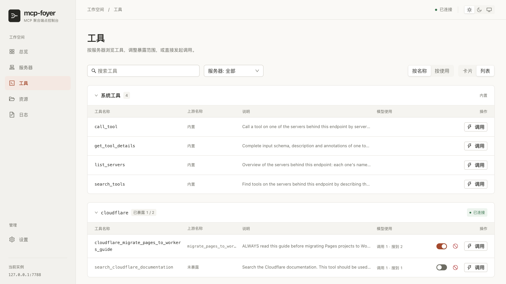
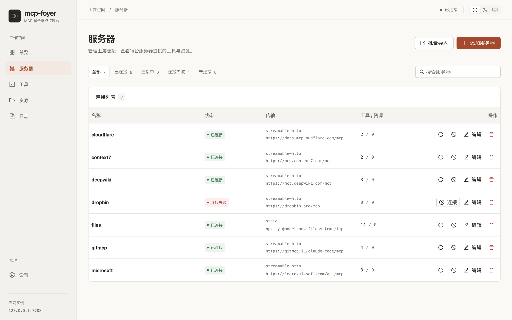

<div align="center">
  
  <h1>MCP Foyer</h1>
  <p><strong>一个 MCP 入口，让工具按需进入上下文。</strong></p>
  <p>统一连接你的 MCP 服务器，让模型按需发现和调用工具。<br />Web 控制台与 CLI，打包在一个二进制中。</p>
  <p>
    <a href="#快速开始"><strong>快速开始</strong></a> ·
    <a href="#工作方式">工作方式</a> ·
    <a href="#web-控制台">界面展示</a> ·
    <a href="#文档">文档</a> ·
    <a href="README.md">English</a>
  </p>
  <p>
    <a href="LICENSE"></a>
    <a href="backend/go.mod"></a>
    <a href="frontend/package.json"></a>
    <a href="docker-compose.example.yml"></a>
  </p>
</div>

<br />

<picture>
  <source media="(prefers-color-scheme: dark)" srcset="docs/assets/tools-dark.png" />
  <source media="(prefers-color-scheme: light)" srcset="docs/assets/tools-light.png" />
  
</picture>

<p align="center"><sub>浏览工具，决定客户端看到什么、能够调用什么。支持浅色与深色主题。</sub></p>

## 为不断增长的工具集合准备

每增加一个 MCP 服务器，就多一份配置、多一些工具 schema，也多一个需要排查的地方。MCP Foyer 将它们统一接入**一个 Streamable HTTP 端点**。

项目面向个人本地使用，尤其适合没有内置渐进式工具发现能力的客户端。默认只向客户端提供**四个系统工具**，模型在需要时搜索上游工具并获取参数结构。服务器和工具不断增加，初始工具列表依然保持精简。

<table>
  <tr>
    <td width="33%" valign="top">
      <h3>🔌 统一连接</h3>
      每个客户端只配置一个地址。之后添加、更换上游服务器，都在 MCP Foyer 中完成。
    </td>
    <td width="33%" valign="top">
      <h3>🔎 按需发现</h3>
      按工具名、描述、服务器或参数搜索。准备调用时，一次搜索即可取得匹配工具的参数结构。
    </td>
    <td width="33%" valign="top">
      <h3>🎛️ 逐个控制工具</h3>
      将常用工具直接暴露给客户端，也可以彻底禁用某个工具，让模型无法搜索和调用。
    </td>
  </tr>
  <tr>
    <td valign="top">
      <h3>🖥️ 查看运行情况</h3>
      查看服务器状态、工具使用次数、资源与实时日志。工具浏览支持卡片和紧凑列表。
    </td>
    <td valign="top">
      <h3>🔗 连接本地与远端</h3>
      同时管理通过 stdio 启动的子进程，以及通过 Streamable HTTP 连接的远端 MCP 服务。
    </td>
    <td valign="top">
      <h3>📦 单个二进制部署</h3>
      Web 界面在构建时嵌入。配置、日志和使用记录保存在数据目录中。
    </td>
  </tr>
</table>

## 快速开始

### 1. 启动 MCP Foyer

使用 **Docker Compose** 时，宿主机无需安装 Go 和 Node.js。镜像从仓库源码在本地构建，并包含 Node.js 与 npm，可以运行基于 `npx` 的上游服务器。

```bash
git clone https://github.com/inwf/mcp-foyer.git
cd mcp-foyer
cp docker-compose.example.yml docker-compose.yml
docker compose up -d --build
```

| 入口 | 地址 |
| --- | --- |
| Web 控制台 | <http://127.0.0.1:7788/> |
| MCP 端点 | <http://127.0.0.1:7788/mcp> |

<details>
<summary><strong>直接运行二进制：从源码构建</strong></summary>

需要 **Go 1.25+**、**Node.js 22.12+**、**pnpm** 和 **make**。在仓库根目录执行：

```bash
make build
./backend/bin/mcp-foyer serve
```

`make build` 会安装前端依赖、构建 Web 界面，并将其嵌入 `backend/bin/mcp-foyer`。启动后的两个地址与上面相同。

后续命令可以使用 `./backend/bin/mcp-foyer`，也可以将二进制放到 `PATH` 中，以 `mcp-foyer` 调用。

上游服务器仍然需要相应运行环境。例如，基于 `npx` 的 stdio 服务器需要运行 MCP Foyer 的机器安装 Node.js 与 npm。

</details>

### 2. 添加上游服务器

打开 Web 控制台，进入**服务器**页面，添加服务器或导入已有配置。本地命令选择 **stdio**，远端 MCP 地址选择 **streamable-http**。

也可以通过 CLI，在 Docker 内添加文件系统服务器：

```bash
docker compose exec mcp-foyer mkdir -p /data/shared
docker compose exec mcp-foyer mcp-foyer servers add files -- \
  npx -y @modelcontextprotocol/server-filesystem /data/shared
```

这个服务器能够访问容器内的 `/data/shared`。需要访问宿主机目录时，在 `docker-compose.yml` 中添加目录挂载，并使用容器内的路径配置服务器。

<details>
<summary><strong>向原生部署添加文件系统服务器</strong></summary>

保持 MCP Foyer 运行，在另一个终端中从仓库根目录执行：

```bash
mkdir -p data/shared
./backend/bin/mcp-foyer servers add files -- \
  npx -y @modelcontextprotocol/server-filesystem "$(pwd)/data/shared"
./backend/bin/mcp-foyer servers list
```

</details>

### 3. 连接 MCP 客户端

选择 **Streamable HTTP**，填写端点 `http://127.0.0.1:7788/mcp`。

以 Claude Code 为例：

```bash
claude mcp add --transport http mcp-foyer http://127.0.0.1:7788/mcp
```

之后可以让模型寻找适合某项任务的工具，例如列出刚才配置的目录中的文件。上游工具可以全部保持未暴露，模型依然能够通过四个系统工具发现和调用它们。

> [!IMPORTANT]
> MCP Foyer 没有内置身份认证。请将管理界面和 MCP 端点限制在本机回环地址，或部署在可信的访问控制之后。管理 API 能够配置在宿主机或容器内执行的命令。

## 工作方式

客户端初始的 `tools/list` 包含四个系统工具：

| 工具 | 用途 |
| --- | --- |
| `list_servers` | 查看服务器名称、描述、连接状态和工具、资源数量。 |
| `search_tools` | 跨服务器搜索工具，或浏览指定服务器；支持分页与可选参数结构。 |
| `get_tool_details` | 获取工具完整的输入 schema、描述和 annotations。 |
| `call_tool` | 按服务器名称和上游原始工具名调用工具。 |

常见的调用过程只需要搜索和调用两步：

1. **寻找工具。** 调用 `search_tools`，设置 `includeSchema: true`，同时获得匹配的工具与参数结构。
2. **调用工具。** 将选中的 `server`、`tool` 和 `args` 传给 `call_tool`。

已经知道工具和参数时，可以直接使用 `call_tool`。已暴露的工具也能通过 `files_read_text_file` 这样的发布名直接调用，命名冲突由 MCP Foyer 自动处理。

### 暴露与禁用

| 工具状态 | 出现在初始工具列表 | 可以发现 | 可以调用 |
| --- | :---: | :---: | :---: |
| **启用、未暴露**，默认状态 | — | 可以 | 可以，通过 `call_tool` |
| **启用、已暴露** | 可以 | 可以 | 可以，直接调用或通过 `call_tool` |
| **已禁用** | — | — | 不可以，包括 Web 和 CLI 调用 |

禁用已暴露的工具时，同一次保存会取消它的暴露配置。重新启用后恢复按需发现，保持未暴露状态。这两种操作都不会重连服务器。四个系统工具始终保留。

## Web 控制台

集中管理连接，查看每台服务器提供的能力，并进入对应的工具和日志页面。

<picture>
  <source media="(prefers-color-scheme: dark)" srcset="docs/assets/servers-dark.png" />
  <source media="(prefers-color-scheme: light)" srcset="docs/assets/servers-light.png" />
  
</picture>

<p align="center"><sub>截图来自实际运行的测试实例。当前 Web 界面使用简体中文。</sub></p>

- **服务器**：添加、编辑、导入、连接和断开上游。
- **工具**：搜索、检查参数、尝试调用、调整暴露范围、逐个禁用。
- **使用记录**：查看模型搜索与调用次数、失败次数和最近活动，按使用情况排序。
- **资源与日志**：浏览上游资源，通过筛选查看实时日志。
- **配置**：通过网页或 YAML 文件修改设置。

## 部署说明

<details>
<summary><strong>Docker 数据、网络与常用命令</strong></summary>

```bash
docker compose logs -f       # 持续查看日志
docker compose restart       # 重启实例
docker compose down          # 停止，保留数据卷
docker compose up -d --build # 更新源码后，重新构建并启动
```

- 命名卷 `mcp-foyer-data` 将配置、日志和使用记录保存在 `/data`。删除数据卷也会删除这些文件。
- `docker-compose.yml` 是被 Git 忽略的本地配置，可以修改宿主机端口和目录挂载；`docker-compose.override.yml` 同样被忽略。
- 示例只发布到 `127.0.0.1:7788`。发布到全部网络接口后，宿主机之外也可能访问 Web 控制台和 MCP 端点。
- 容器首次启动时，入口脚本会初始化配置，将 `security.allowedNetworks` 设为空列表。进入容器的请求被允许，访问范围由宿主机发布端口控制。后续启动保留已有配置。
- 修改监听设置或会话模式规则后需要重启。

</details>

<details>
<summary><strong>原生数据目录与无界面构建</strong></summary>

默认数据目录为 `./data`，相对于进程工作目录。可以通过 `--data-dir` 或 `MCP_FOYER_DATA_DIR` 指定其他位置。

```bash
./backend/bin/mcp-foyer serve --data-dir ./data
```

`make build` 包含 Web 界面。不带 `webui` 标签构建时，生成的二进制仍然提供管理 API 和 MCP 端点：

```bash
cd backend
go build -o bin/mcp-foyer ./cmd/mcp-foyer
```

</details>

## 文档

| 内容 | 入口 |
| --- | --- |
| 英文介绍与快速开始 | [English README](README.md) |
| 完整 CLI 用法 | `mcp-foyer guide` · [使用指南](backend/internal/guide/guide.md) |
| 配置字段与默认值 | [配置参考](docs/configuration.md) |
| 发现、搜索与 MCP 行为 | [模型接口说明](docs/mcp-surface.md) |
| 搜索基准与 SDK 互操作 | [性能与兼容性验证](docs/performance.md) |

## 开发

```bash
make help   # 查看可用目标
make build  # 构建 Web 界面与单个二进制
make check  # Go 格式、vet、race 测试；TypeScript、oxlint、Vitest
make dev    # 查看前后端分别启动的命令
```

开发时在两个终端中分别启动：

```bash
# 终端 1
cd backend && go run ./cmd/mcp-foyer serve
```

```bash
# 终端 2；同时安装前端依赖
cd frontend && pnpm install --frozen-lockfile && pnpm dev
```

Vite 将 `/api`、`/ws` 和 `/mcp` 代理到后端，并保留浏览器来源用于 WebSocket 校验。提交修改前运行 `make check`。

| 部分 | 使用的技术 |
| --- | --- |
| 后端 | Go · 官方 MCP Go SDK · Gin · Cobra · `log/slog` |
| 前端 | React 19 · TypeScript · Vite · Ant Design · TanStack Query · Zustand |
| 分发 | 嵌入式 Web 资源 · 单个二进制 · Docker Compose |

## 许可证

[MIT](LICENSE) © 2026 inwf。

<p align="center"><sub>如果 MCP Foyer 让你的 MCP 配置更容易管理，欢迎在 <a href="https://github.com/inwf/mcp-foyer">GitHub</a> 上点亮 Star，让更多人发现它。</sub></p>
